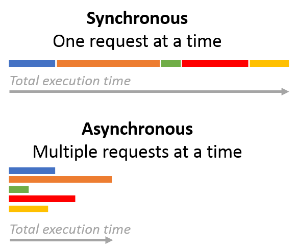
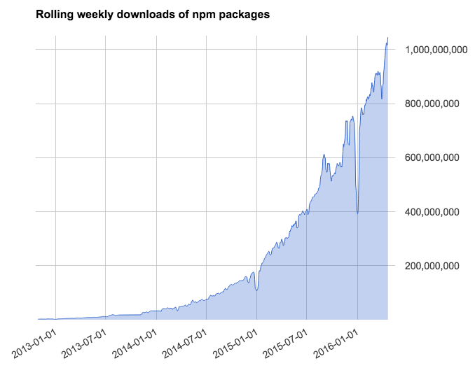

# DAY 1 of `node-wix-kickstart` 

## Before all



 - https://www.quora.com/What-is-the-better-web-server-stack-Nginx-or-Apache
 - https://drupal.stackexchange.com/a/75057

## The Rise of Node.js programming

### What is Node.js? 

So-called Node.js framework is actually not a framework or a library, but a runtime environment, based on Chrome’s V8 JavaScript engine.

Link: https://nodejs.org/en/

### When introduced?

The technology was first introduced back in 2009 by `Ryan Dahl` at the annual European JSConf and was immediately recognized as “the most exciting single piece of software in the current JavaScript universe”. 

Link: https://www.youtube.com/watch?v=ztspvPYybIY

### Who is sponsor?

As an open-source project, Node.js was sponsored by `Joyent`, a cloud computing and hosting solutions provider. The company invested in a number of other technologies, such as Ruby on Rails framework, and provided hosting services to Twitter and LinkedIn. The latter also became one of the first companies to use Node.js for its mobile application backend. The technology was later adopted by a number technology leaders, such as Uber, eBay, Walmart, and Netflix, to name a few.

### Trend?

However, it wasn’t until recently that a wide adoption of server-side JavaScript with Node.js started. The interest in this technology peaked in 2014, as per Google Trends, and remains high.


## The Good and the Bad of Node.js Web App Development

### (+) Robust technology stack

JavaScript has proven to be an undisputed leader among the most popular programming languages. Node.js, in turn, is also gaining popularity, with 7 million users and an annual growth rate at 100%, as stated by 2017 Node.js User Survey Report.

Using Node.js for backend, you automatically get all the pros of full stack JavaScript development, such as:

 - better efficiency and overall developer productivity
 - code sharing and reuse
 - speed and performance
 - easy knowledge sharing within a team
 - huge number of free tools
 
Consequently, your team is a lot more flexible, the development is less time-consuming and as a result you get fast and reliable software.

### (+) Fast and event-based

What is Node.js used for? When using a common language for both client- and server-side, synchronization happens fast, which is especially helpful for event-based, real-time applications. Thanks to its asynchronous, non-blocking, single-threaded nature, Node.js is a popular choice for online gaming, chats, video conferences, or any solution that requires constantly updated data. The examples speak for themselves: many leading companies switched technologies to developed Node.js applications and noticed significant improvements – PayPal, for instance, noticed 35 percent decrease in response time since migrating from Java.

Not only does app performance benefit from Node.js’ lightness, the team’s productivity will increase as well. Developers trained in frontend JavaScript can start programming the server side with the minimum learning curve. With the same language on both sides, you can reuse code on front-end and back-end by wrapping it into modules and creating a new level of abstraction.

### (+) Scalable technology for microservices

Since it’s a lightweight technology tool, using Node.js for microservices architecture is a great choice. This architectural style is best described by Martin Fowler and James Lewis as “an approach to developing a single application as a suite of small services, each running in its own process and communicating with lightweight mechanisms, often an HTTP resource API.”

Accordingly, breaking the application logic into smaller modules, microservices, instead of creating a single, large monolithic core, you enable better flexibility and lay the groundwork for further growth. As a result, it is much easier to add more microservices on top of the existing ones than to integrate additional features with the basic app functionality.


Node.js is the technology of choice when building and deploying microservices solutions, according to the recent Node.js User Survey Report. About a half of the respondents are already using microservice-related technologies (namely, Docker, the leading software containerization platform) to build Node.js web apps:

With each microservice communicating with the database directly through streams, such architecture allows for better performance and speed of application. 
Namely, `Walmart’s` shift to microservices architecture with Node.js resulted in the following immediate benefits:

 - Overnight 20 percent conversion growth in general and 98 percent mobile conversion growth
 - One hundred percent uptime on Black Friday (handling over 500 million pageviews)
 - Saving up to 40 percent on hardware and 20-50 percent on overall operations

Another bright example of how Node.js can outperform the competition in terms of performance is the case of `GoDaddy`. 

 - Running the SuperBowl ad campaign, the company was able to handle 10.000 requests per second without downtime, using only 10 percent of the hardware thanks to Node.js.

### (+) Rich ecosystem

One word – npm, a default Node.js package manager, it also serves as a marketplace for open source JavaScript tools, which plays an important role in the advance of this technology. With about 350,000 tools available in the npm registry as of now, and over 10,000 new ones being published every week, the Node.js ecosystem is quite rich. And it is actively used by developers, based on the number of weekly packages downloads.



Link: https://blog.npmjs.org/post/143451680695/how-many-npm-users-are-there

### (+) Strong corporate support

As mentioned above, the development of Node.js was supported by Joyent. In 2015, the Node.js Foundation was created to “enable widespread adoption and help accelerate development of Node.js.” IBM, Microsoft, PayPal, Fidelity and SAP became the founding members of the organization.

The list of organizations using Node.js in production is constantly growing. It currently includes almost three hundred well-known companies, such as Wix, PayPal, Medium, Trello, Uber and Linkedin.

Very few open source projects have ever enjoyed such strong support from the world’s leading companies.

### (-) Performance bottlenecks for CPU-bound tasks

As we know, JavaScript (and, as a result, Node.js) is asynchronous by nature and has a non-blocking I/O (input/output) model. This means, it can process several simple tasks (for example, read/write database queries) queued in the background without blocking the main thread and do so quickly.

At the same time, Node.js is a single-threaded environment, which is often considered a serious drawback of the technology. Indeed, in some cases, a CPU-bound task (number crunching, various calculations) can block the event loop resulting in seconds of delay for all Node.js website users.

This represents a serious issue. That is why, to avoid it, it is recommended not to use Node.js with computation-heavy systems.

### (-) Growing demand for experienced professionals

Despite a common belief, not all JavaScript developers are Node.js developers as well. Mastering server side JavaScript programming requires a significant amount of effort and a certain background in backend development. Due to such a steep learning curve, the number of Node.js engineers is significantly lower than the total number of JS professionals.

However, a relatively new technology niche cannot meet this demand. The number of Node.js job postings is 3-4 times bigger than the number of job seekers with relevant skillset.


## Installation 

 - Link: https://nodejs.org/en/download/package-manager/#alternatives
 - Link: https://brew.sh/

#### Option 1:

```bash
brew update
brew install node@10
brew unlink node
brew link --force --overwrite node@10
node -v
```

#### Option 2:

```bash
If you need to have this software first in your PATH instead consider running:
echo 'export PATH="/usr/local/opt/node@10/bin:$PATH"' >> ~/.bash_profile
```

## Links for examples:

 - Axios: https://www.npmjs.com/package/axios
 - Lodash: https://lodash.com/docs/4.17.11
 - Binance API: https://github.com/binance-exchange/binance-official-api-docs
 - Public APIs: https://github.com/toddmotto/public-apis
 
## Self study:

 - Node.js Best Materials (EN): https://medium.com/@angularminds/best-online-resources-to-learn-nodejs-60f1772f43b1
 - Node.js Screencast (RU): https://learn.javascript.ru/screencast/nodejs
