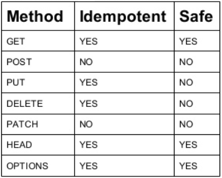
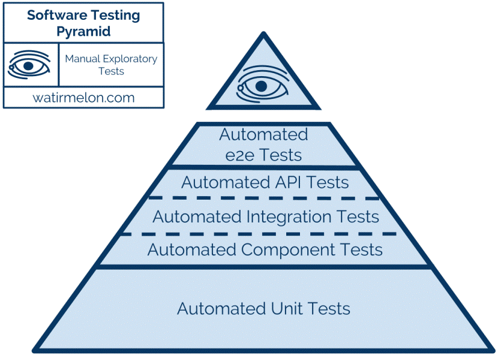
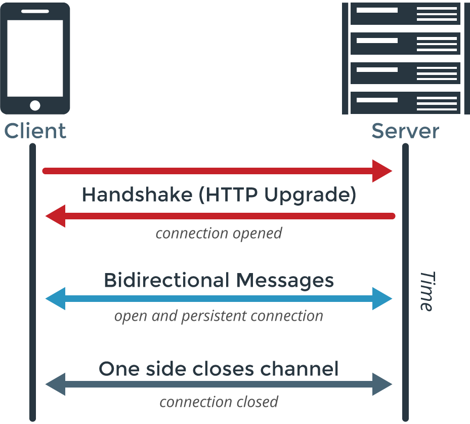

# DAY 2 of `node-wix-kickstart` 

### REST API

`REST`, or `REpresentational State Transfer`, is an architectural style for providing standards between computer systems on the web, making it easier for systems to communicate with each other. 
REST-compliant systems, often called RESTful systems, are characterized by how they are stateless and separate the concerns of client and server. We will go into what these terms mean and why they are beneficial characteristics for services on the Web.

Link:

 - REST API: https://www.codecademy.com/articles/what-is-rest
 - About HTTP methods: https://medium.com/@kumaraksi/using-http-methods-for-restful-services-e6671cf70d4d
 - Swagger recommendations: https://swagger.io/resources/articles/best-practices-in-api-design/
 - JSON Patch: http://jsonpatch.com/

### Tests

Links: 

 - Mocha https://github.com/mochajs/mocha
 - Supertest https://github.com/visionmedia/supertest
 - Top of test theory https://martinfowler.com/articles/microservice-testing/
 - Very good presentation (RU) https://www.youtube.com/watch?v=PZq_J1AuSL0

### Cross-Origin Resource Sharing (CORS)
    
Cross-origin resource sharing, or CORS, is a security feature of modern web browsers. It enables web browsers to negotiate which domains can make requests of external websites or services. CORS is an important consideration when developing browser applications with the AWS SDK for JavaScript because most requests to resources are sent to an external domain, such as the endpoint for a web service. If your JavaScript environment enforces CORS security, you must configure CORS with the service.

CORS determines whether to allow sharing of resources in a cross-origin request based on:

 - The specific domain that makes the request
 - The type of HTTP request being made (GET, PUT, POST, DELETE and so on)
    

Link (RU): http://spring-projects.ru/understanding/cors/

### Authentication and Authorization

`Authentication` is the process of ascertaining that somebody really is who they claim to be.

`Authorization` refers to rules that determine who is allowed to do what. E.g. Adam may be authorized to create and delete databases, while Usama is only authorised to read.

#### In short:

`Authentication` = login + password (who you are?)

`Authorization` = permissions (what you are allowed to do?)

Links:

 - JWT https://jwt.io/
 - Passport.js http://www.passportjs.org/
 - Passport.js for Wix http://www.passportjs.org/packages/passport-wix-app/

## WebSockets

WebSockets provide a persistent connection between a client and server that both parties can use to start sending data at any time.

Link:

 - WebSockets example https://flaviocopes.com/node-websockets/
 - https://medium.com/platform-engineer/web-api-design-35df8167460

## Self study:

 - https://learn.javascript.ru/screencast/nodejs
